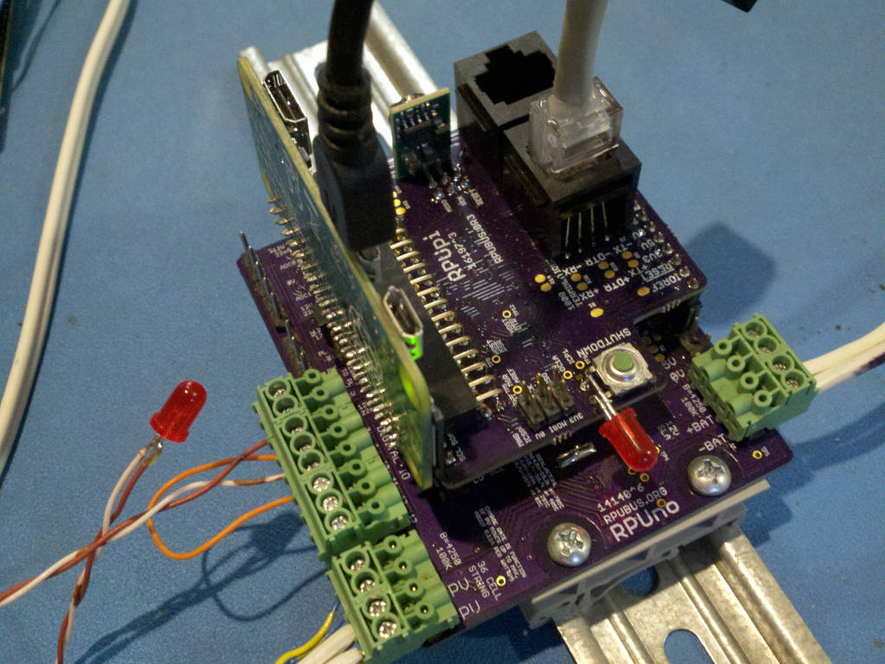
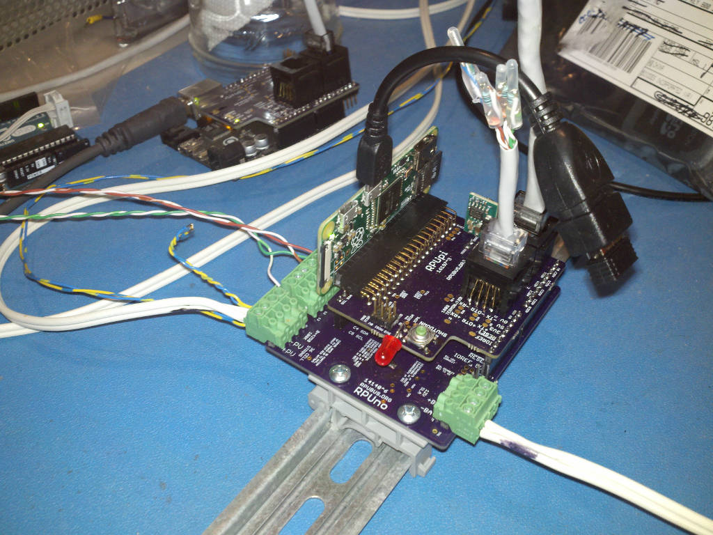
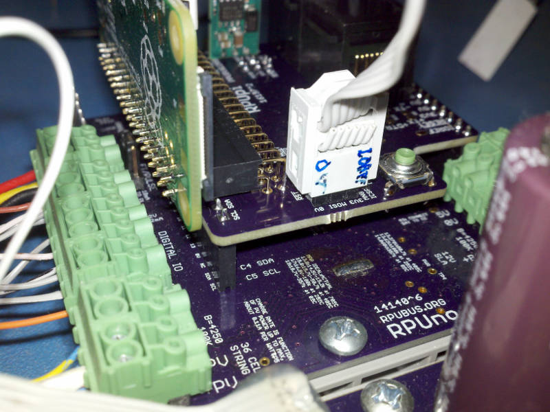
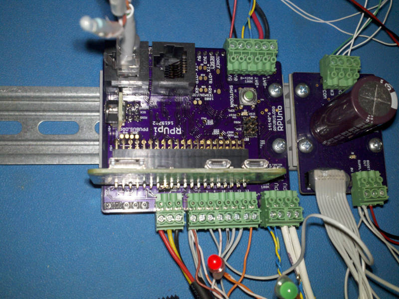
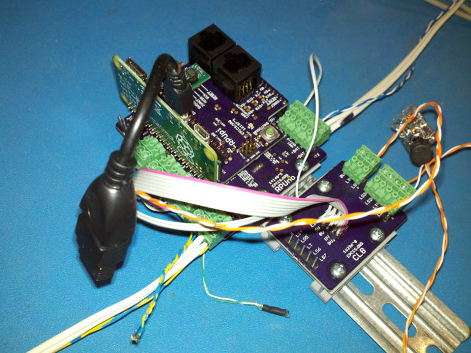
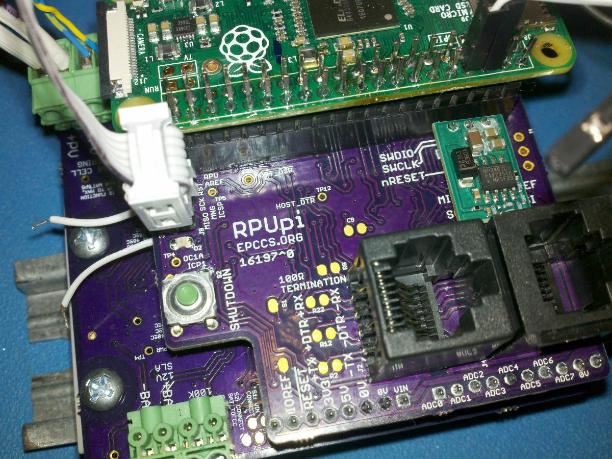

# Description

This shows the setup and methods used for evaluation of RPUpi.

# Table of References


# Table Of Contents:

1. ^4 I2C1 Checked With Raspberry Pi Zero
1. ^4 SPI 2MHz Checked With Raspberry Pi Zero
1. ^3 SPI Interface
1. ^3 Power Data
1. ^3 Bootload Remote AVR
1. ^2 Clearance IDE Connector For ICSP Tool
1. ^2 Clearance Between Pi and Plugable
1. ^1 Vertical Mounting
1. ^0 Mounting


## ^4 I2C1 Checked With Raspberry Pi Zero

Scan the smbus (I2C1) with Raspberry Pi.

```
sudo apt-get install i2c-tools python3-smbus
sudo usermod -a -G i2c rsutherland
# logout for the change to take
i2cdetect 1
WARNING! This program can confuse your I2C bus, cause data loss and worse!
I will probe file /dev/i2c-1.
I will probe address range 0x03-0x77.
Continue? [Y/n] Y
     0  1  2  3  4  5  6  7  8  9  a  b  c  d  e  f
00:          -- -- -- -- -- -- -- -- -- -- -- -- --
10: -- -- -- -- -- -- -- -- -- -- -- -- -- -- -- --
20: -- -- -- -- -- -- -- -- -- -- 2a -- -- -- -- --
30: -- -- -- -- -- -- -- -- -- -- -- -- -- -- -- --
40: -- -- -- -- -- -- -- -- -- -- -- -- -- -- -- --
50: -- -- -- -- -- -- -- -- -- -- -- -- -- -- -- --
60: -- -- -- -- -- -- -- -- -- -- -- -- -- -- -- --
70: -- -- -- -- -- -- -- --
```

The [Remote] firmware has the host (Raspberry Pi Zero) locked out from using the serial connection, but with I2C1 it can be enabled. One of the status bits is for host lockout. The SMBus command 7 is used to set that status bit.

[Remote]: https://github.com/epccs/RPUpi/tree/master/Remote

``` 
python3
import smbus
bus = smbus.SMBus(1)
# use SMBus command 0 to show the local address 
#write_i2c_block_data(I2C_ADDR, I2C_COMMAND, DATA)
bus.write_i2c_block_data(42, 0, [0])
#read_i2c_block_data(I2C_ADDR, OFFSET, NUM_OF_BYTES)
#OFFSET is not implemented
chr(bus.read_i2c_block_data(42,0, 2)[1])
'1'
# use SMBus command 2 to show the bootload address 
bus.write_i2c_block_data(42, 2, [0])
chr(bus.read_i2c_block_data(42,0, 2)[1])
'0'
# use SMBus command 3 to change the bootload address (49 is ascii '1')
bus.write_i2c_block_data(42, 3, [49])
chr(bus.read_i2c_block_data(42,0, 2)[1])
'1'
# use SMBus command 7 to clear the lockout bit in the status bits that was set at power up.
bus.write_i2c_block_data(42, 7, [0])
print(bus.read_i2c_block_data(42,0, 2))
[7, 0]
exit()
picocom -b 38400 /dev/ttyAMA0
...
Terminal ready
/1/id?
# C-a, C-x.
``` 

Once the host lockout is clear the Raspberry Pi can bootload the address set with command 3 (see [Remote]). The Raspberry Pi will need to use its [RTS] handshack lines for avrdude to work.

[RTS]: https://github.com/epccs/RPUpi/tree/master/RPiRtsCts


## ^4 SPI 2MHz Checked With Raspberry Pi Zero

Note: AVR's nSS that went to Pi's nCE10 was changed to nCE00 for this test, it needs to be fixed on next board version.

The unit under test is at address '1'. So first I need to bootload its controller (an RPUno^9) with [SpiSlv].

[SpiSlv]:https://github.com/epccs/RPUno/tree/master/SpiSlv

To do that I set the booload address on the shield that is connected to the host which will build [SpiSlv] and upload the firmware. 

``` 
# first set user premision to use the SPI port
sudo usermod -a -G spi rsutherland
# logout for the change to take
# Write the address '1' (0x31) that will be sent when nRTS enables.
# Next clear the lockout bit to alow the Pi Zero to use the RPUBUS as a host (e.g. from the Pi Zero in sneaky mode)
picocom -b 38400 /dev/ttyAMA0
...
Terminal ready
/1/iaddr 41
{"address":"0x29"}
/1/ibuff 3,49
{"txBuffer[2]":[{"data":"0x3"},{"data":"0x31"}]}
/1/iread? 2
{"rxBuffer":[{"data":"0x3"},{"data":"0x31"}]}
/1/ibuff 7,0
{"txBuffer[2]":[{"data":"0x7"},{"data":"0x0"}]}
/1/iread? 2
# ASCII character glitch may show now since the local controller has just reset
# C-a, C-x.

# next check that RPU '1' is blinking fast
picocom -b 38400 /dev/ttyAMA0
...
Terminal ready
# C-a, C-x.

# now change the working directory to where SpiSlv is and then build and upload
cd ~/wher_you_told_git_to_clone/RPUno/SpiSlv
make bootload
...
avrdude done.  Thank you.

# 
gcc -o spidev_test spidev_test.c
chmod ugo+x ./spidev_test
# trun on the RPU SPI port
picocom -b 38400 /dev/ttyAMA0
...
Terminal ready
/1/id?
{"id":{"name":"SpiSlv","desc":"RPUno (14140^9) Board /w atmega328p","avr-gcc":"5.4.0"}}
/1/spi UP
{"SPI":"UP"}
# C-a, C-x.
# test with
./spidev_test -s 1000 -D /dev/spidev0.0
./spidev_test -s 10000 -D /dev/spidev0.0
./spidev_test -s 100000 -D /dev/spidev0.0
./spidev_test -s 250000 -D /dev/spidev0.0
./spidev_test -s 500000 -D /dev/spidev0.0
./spidev_test -s 1000000 -D /dev/spidev0.0
./spidev_test -s 2000000 -D /dev/spidev0.0
# 4MHz fails on this RPUpi^4 setup with nCE10 swaped to nCE00.
```

The test output should look like this

```
spi mode: 0
bits per word: 8
max speed: 500000 Hz (500 KHz)

0D FF FF FF FF FF
FF 40 00 00 00 00
95 FF FF FF FF FF
FF FF FF FF FF FF
FF FF FF FF FF FF
FF DE AD BE EF BA
AD F0
``` 

The maximum speed seen is 2MegHz.


## ^3 SPI Interface

Firmware [SpiSlv] is used to enable the SPI port on a RPUno (ATmega328p).

[SpiSlv]: https://github.com/epccs/RPUno/tree/master/SpiSlv

After loading the firmware on an RPUno and enabling the AVR's SPI I next need the Raspberry Pi [SPI] hardware setup. Raspian needs its interface master driver enabled (e.g. [raspi-config]).

[SPI]: https://www.raspberrypi.org/documentation/hardware/raspberrypi/spi/README.md
[raspi-config]: https://www.raspberrypi.org/documentation/configuration/raspi-config.md

Raspibin has an spi group setup in /etc/udev/rules.d/99-com.rules. So I can add my user name to that group for the system to allow me to use the interface.

``` 
sudo usermod -a -G spi rsutherland
# logout for the change to take
``` 

Next I compile and run spidev_test.c on the Pi with:

``` 
wget https://raw.githubusercontent.com/raspberrypi/linux/rpi-3.10.y/Documentation/spi/spidev_test.c
gcc -o spidev_test spidev_test.c
# run with
./spidev_test -s 100000 -D /dev/spidev0.0
./spidev_test -s 500000 -D /dev/spidev0.0
./spidev_test -s 1000000 -D /dev/spidev0.0
./spidev_test -s 2000000 -D /dev/spidev0.0

spi mode: 0
bits per word: 8
max speed: 500000 Hz (500 KHz)

0D FF FF FF FF FF
FF 40 00 00 00 00
95 FF FF FF FF FF
FF FF FF FF FF FF
FF FF FF FF FF FF
FF DE AD BE EF BA
AD F0
``` 

Note: The output is offset a byte since it was sent back from the AVR. I see errors at 1MHz and 2MHz. The RPUpi^3 has a 74LVC07 buffer that pulls down through a 10kOhm resistor on SCK and MOSI. The circuit between that resistor and the AVR has some capacitance which will limit the speed (if there is a need for higher speed it may be possible to swap in a 1k resistor).




## ^3 Power Data

PV input to RPUno is at 200mA in Constant Current mode

```
/1/analog? 7,6,3,2
{"PWR_V":"14.15","PV_V":"16.88","DISCHRG_A":"0.003","CHRG_A":"0.024"}
{"PWR_V":"14.15","PV_V":"16.88","DISCHRG_A":"0.000","CHRG_A":"0.052"}
{"PWR_V":"14.15","PV_V":"16.85","DISCHRG_A":"0.000","CHRG_A":"0.036"}
{"PWR_V":"14.15","PV_V":"16.83","DISCHRG_A":"0.000","CHRG_A":"0.030"}
{"PWR_V":"14.15","PV_V":"16.93","DISCHRG_A":"0.000","CHRG_A":"0.030"}
{"PWR_V":"14.15","PV_V":"16.85","DISCHRG_A":"0.000","CHRG_A":"0.039"}
{"PWR_V":"14.10","PV_V":"16.93","DISCHRG_A":"0.000","CHRG_A":"0.062"}
{"PWR_V":"14.16","PV_V":"16.83","DISCHRG_A":"0.000","CHRG_A":"0.080"}
{"PWR_V":"14.15","PV_V":"16.88","DISCHRG_A":"0.000","CHRG_A":"0.066"}
{"PWR_V":"14.15","PV_V":"16.88","DISCHRG_A":"0.000","CHRG_A":"0.014"}
```

Readings were taken every 30 seconds, this should give an idea how the Pi Zero power usage fluctuates.

PV to RPUno is now turned off so all power is from the 12 SLA Battery (18Ahr AGM). Note 20mA is used on some status LED's controlled by DIO 4 and DIO 13. 

```
/1/analog? 7,6,3,2
{"PWR_V":"13.91","PV_V":"0.16","DISCHRG_A":"0.142","CHRG_A":"0.000"}
{"PWR_V":"13.78","PV_V":"0.36","DISCHRG_A":"0.123","CHRG_A":"0.000"}
{"PWR_V":"13.69","PV_V":"0.34","DISCHRG_A":"0.122","CHRG_A":"0.000"}
{"PWR_V":"13.68","PV_V":"0.29","DISCHRG_A":"0.154","CHRG_A":"0.000"}
{"PWR_V":"13.62","PV_V":"0.31","DISCHRG_A":"0.162","CHRG_A":"0.000"}
{"PWR_V":"13.58","PV_V":"0.31","DISCHRG_A":"0.156","CHRG_A":"0.000"}
{"PWR_V":"13.53","PV_V":"0.31","DISCHRG_A":"0.175","CHRG_A":"0.000"}
{"PWR_V":"13.49","PV_V":"0.31","DISCHRG_A":"0.154","CHRG_A":"0.000"}
{"PWR_V":"13.44","PV_V":"0.34","DISCHRG_A":"0.136","CHRG_A":"0.000"}
```

Readings were taken every 30 seconds.

The [PwrMgt] firmware running on the board under RPUpi can show how many mAHr is used from the battery.

[PwrMgt]: https://github.com/epccs/RPUno/tree/master/PwrMgt

```
/1/charge?
{"CHRG_mAHr":"316.96","DCHRG_mAHr":"19.99","RMNG_mAHr":"0.00","ACCUM_Sec":"14884.78"}
{"CHRG_mAHr":"316.96","DCHRG_mAHr":"21.86","RMNG_mAHr":"0.00","ACCUM_Sec":"14944.78"}
{"CHRG_mAHr":"316.96","DCHRG_mAHr":"23.73","RMNG_mAHr":"0.00","ACCUM_Sec":"15004.78"}
{"CHRG_mAHr":"316.96","DCHRG_mAHr":"25.61","RMNG_mAHr":"0.00","ACCUM_Sec":"15064.78"}
{"CHRG_mAHr":"316.96","DCHRG_mAHr":"27.49","RMNG_mAHr":"0.00","ACCUM_Sec":"15124.78"}
# I ran this befor going out to do some work in the garden, but this is a far as it got.
# Did the AVR mcu reset? 
# The mcu seems to have lost the CHRG mAHr thought the ssh connection never broke
# I bet this has to do with the Night_AttachWork callback that is not implemented 
/1/charge?
{"CHRG_mAHr":"0.00","DCHRG_mAHr":"549.85","RMNG_mAHr":"0.00","ACCUM_Sec":"16483.48"}
{"CHRG_mAHr":"0.00","DCHRG_mAHr":"551.86","RMNG_mAHr":"0.00","ACCUM_Sec":"16543.48"}
{"CHRG_mAHr":"0.00","DCHRG_mAHr":"553.86","RMNG_mAHr":"0.00","ACCUM_Sec":"16603.48"}
{"CHRG_mAHr":"0.00","DCHRG_mAHr":"555.87","RMNG_mAHr":"0.00","ACCUM_Sec":"16663.48"}
{"CHRG_mAHr":"0.00","DCHRG_mAHr":"557.88","RMNG_mAHr":"0.00","ACCUM_Sec":"16723.48"}
{"CHRG_mAHr":"0.00","DCHRG_mAHr":"559.88","RMNG_mAHr":"0.00","ACCUM_Sec":"16783.48"}
{"CHRG_mAHr":"0.00","DCHRG_mAHr":"561.89","RMNG_mAHr":"0.00","ACCUM_Sec":"16843.48"}
{"CHRG_mAHr":"0.00","DCHRG_mAHr":"563.89","RMNG_mAHr":"0.00","ACCUM_Sec":"16903.48"}
{"CHRG_mAHr":"0.00","DCHRG_mAHr":"565.90","RMNG_mAHr":"0.00","ACCUM_Sec":"16963.48"}
{"CHRG_mAHr":"0.00","DCHRG_mAHr":"567.90","RMNG_mAHr":"0.00","ACCUM_Sec":"17023.48"}
{"CHRG_mAHr":"0.00","DCHRG_mAHr":"569.91","RMNG_mAHr":"0.00","ACCUM_Sec":"17083.48"}
{"CHRG_mAHr":"0.00","DCHRG_mAHr":"571.91","RMNG_mAHr":"0.00","ACCUM_Sec":"17143.48"}
{"CHRG_mAHr":"0.00","DCHRG_mAHr":"573.92","RMNG_mAHr":"0.00","ACCUM_Sec":"17203.48"}
{"CHRG_mAHr":"0.00","DCHRG_mAHr":"575.93","RMNG_mAHr":"0.00","ACCUM_Sec":"17263.48"}
/1/analog? 7,6,3,2
{"PWR_V":"12.92","PV_V":"0.31","DISCHRG_A":"0.152","CHRG_A":"0.000"}
```

Charge readings were taken every 60 seconds. The ACCUM Sec is about 4.8 Hr during which it used .6 AHr. That is more power than I would like it to use, but it seems reasonable based on the static current readings. The best charge I've seen so far is about .3AHr per day for a Watt of PV so this is saying I need a minim of 10 Watt of PV to run the Pi, and it needs to always be the best day for charging that I've seen the data for.

These were all done over SSH and WiFi (ohterwise the Pi had no load)

```
sudo iwlist wlan0 scan
TBD
```


## ^3 Bootload Remote AVR



The hostname of the Pi Zero is pi3, it was the third Pi Zero I have setup (it is a bad hostname). The default bootload address on the RPUftdi (e.g. my multi-drop RS-422 board) is '0', and I have not changed it, I keep the [i2c-debug] firmware on an ATmega328p board under the RPUftdi for use on my test bench, so I will just upload that same program compiled from the Pi Zero. 

[i2c-debug]: https://github.com/epccs/RPUno/tree/master/i2c-debug

```
rsutherland@pi3:~/Samba/RPUno/i2c-debug $ uname -a
Linux pi3 4.9.41+ #1023 Tue Aug 8 15:47:12 BST 2017 armv6l GNU/Linux
rsutherland@pi3:~/Samba/RPUno/i2c-debug $ make bootload
avr-gcc -Os -g -std=gnu99 -Wall -ffunction-sections -fdata-sections  -DF_CPU=16000000UL   -DBAUD=38400UL -I.  -mmcu=atmega328p -c -o main.o main.c
avr-gcc -Os -g -std=gnu99 -Wall -ffunction-sections -fdata-sections  -DF_CPU=16000000UL   -DBAUD=38400UL -I.  -mmcu=atmega328p -c -o i2c-scan.o i2c-scan.c
avr-gcc -Os -g -std=gnu99 -Wall -ffunction-sections -fdata-sections  -DF_CPU=16000000UL   -DBAUD=38400UL -I.  -mmcu=atmega328p -c -o i2c-cmd.o i2c-cmd.c
avr-gcc -Os -g -std=gnu99 -Wall -ffunction-sections -fdata-sections  -DF_CPU=16000000UL   -DBAUD=38400UL -I.  -mmcu=atmega328p -c -o ../Uart/id.o ../Uart/id.c
avr-gcc -Os -g -std=gnu99 -Wall -ffunction-sections -fdata-sections  -DF_CPU=16000000UL   -DBAUD=38400UL -I.  -mmcu=atmega328p -c -o ../lib/timers.o ../lib/timers.c
avr-gcc -Os -g -std=gnu99 -Wall -ffunction-sections -fdata-sections  -DF_CPU=16000000UL   -DBAUD=38400UL -I.  -mmcu=atmega328p -c -o ../lib/uart.o ../lib/uart.c
avr-gcc -Os -g -std=gnu99 -Wall -ffunction-sections -fdata-sections  -DF_CPU=16000000UL   -DBAUD=38400UL -I.  -mmcu=atmega328p -c -o ../lib/twi.o ../lib/twi.c
avr-gcc -Os -g -std=gnu99 -Wall -ffunction-sections -fdata-sections  -DF_CPU=16000000UL   -DBAUD=38400UL -I.  -mmcu=atmega328p -c -o ../lib/rpu_mgr.o ../lib/rpu_mgr.c
avr-gcc -Os -g -std=gnu99 -Wall -ffunction-sections -fdata-sections  -DF_CPU=16000000UL   -DBAUD=38400UL -I.  -mmcu=atmega328p -c -o ../lib/adc.o ../lib/adc.c
avr-gcc -Os -g -std=gnu99 -Wall -ffunction-sections -fdata-sections  -DF_CPU=16000000UL   -DBAUD=38400UL -I.  -mmcu=atmega328p -c -o ../lib/parse.o ../lib/parse.c
avr-gcc -Wl,-Map,I2c-debug.map  -Wl,--gc-sections  -mmcu=atmega328p main.o i2c-scan.o i2c-cmd.o ../Uart/id.o ../lib/timers.o ../lib/uart.o ../lib/twi.o ../lib/rpu_mgr.o ../lib/adc.o ../lib/parse.o -o I2c-debug.elf
avr-size -C --mcu=atmega328p I2c-debug.elf
AVR Memory Usage
----------------
Device: atmega328p

Program:    8684 bytes (26.5% Full)
(.text + .data + .bootloader)

Data:        375 bytes (18.3% Full)
(.data + .bss + .noinit)


rm -f I2c-debug.o main.o i2c-scan.o i2c-cmd.o ../Uart/id.o ../lib/timers.o ../lib/uart.o ../lib/twi.o ../lib/rpu_mgr.o ../lib/adc.o ../lib/parse.o
avr-objcopy -j .text -j .data -O ihex I2c-debug.elf I2c-debug.hex
rm -f I2c-debug.elf
avrdude -v -p atmega328p -c arduino -P /dev/ttyAMA0 -b 115200 -U flash:w:I2c-debug.hex

avrdude: Version 6.1, compiled on Jul  7 2015 at 10:29:47
         Copyright (c) 2000-2005 Brian Dean, http://www.bdmicro.com/
         Copyright (c) 2007-2014 Joerg Wunsch

         System wide configuration file is "/etc/avrdude.conf"
         User configuration file is "/home/rsutherland/.avrduderc"
         User configuration file does not exist or is not a regular file, skipping

         Using Port                    : /dev/ttyAMA0
         Using Programmer              : arduino
         Overriding Baud Rate          : 115200
         AVR Part                      : ATmega328P
         Chip Erase delay              : 9000 us
         PAGEL                         : PD7
         BS2                           : PC2
         RESET disposition             : dedicated
         RETRY pulse                   : SCK
         serial program mode           : yes
         parallel program mode         : yes
         Timeout                       : 200
         StabDelay                     : 100
         CmdexeDelay                   : 25
         SyncLoops                     : 32
         ByteDelay                     : 0
         PollIndex                     : 3
         PollValue                     : 0x53
         Memory Detail                 :

                                  Block Poll               Page                       Polled
           Memory Type Mode Delay Size  Indx Paged  Size   Size #Pages MinW  MaxW   ReadBack
           ----------- ---- ----- ----- ---- ------ ------ ---- ------ ----- ----- ---------
           eeprom        65    20     4    0 no       1024    4      0  3600  3600 0xff 0xff
           flash         65     6   128    0 yes     32768  128    256  4500  4500 0xff 0xff
           lfuse          0     0     0    0 no          1    0      0  4500  4500 0x00 0x00
           hfuse          0     0     0    0 no          1    0      0  4500  4500 0x00 0x00
           efuse          0     0     0    0 no          1    0      0  4500  4500 0x00 0x00
           lock           0     0     0    0 no          1    0      0  4500  4500 0x00 0x00
           calibration    0     0     0    0 no          1    0      0     0     0 0x00 0x00
           signature      0     0     0    0 no          3    0      0     0     0 0x00 0x00

         Programmer Type : Arduino
         Description     : Arduino
         Hardware Version: 3
         Firmware Version: 4.4
         Vtarget         : 0.3 V
         Varef           : 0.3 V
         Oscillator      : 28.800 kHz
         SCK period      : 3.3 us

avrdude: AVR device initialized and ready to accept instructions

Reading | ################################################## | 100% 0.00s

avrdude: Device signature = 0x1e950f
avrdude: safemode: lfuse reads as 0
avrdude: safemode: hfuse reads as 0
avrdude: safemode: efuse reads as 0
avrdude: NOTE: "flash" memory has been specified, an erase cycle will be performed
         To disable this feature, specify the -D option.
avrdude: erasing chip
avrdude: reading input file "I2c-debug.hex"
avrdude: input file I2c-debug.hex auto detected as Intel Hex
avrdude: writing flash (8684 bytes):

Writing | ################################################## | 100% 1.20s

avrdude: 8684 bytes of flash written
avrdude: verifying flash memory against I2c-debug.hex:
avrdude: load data flash data from input file I2c-debug.hex:
avrdude: input file I2c-debug.hex auto detected as Intel Hex
avrdude: input file I2c-debug.hex contains 8684 bytes
avrdude: reading on-chip flash data:

Reading | ################################################## | 100% 0.95s

avrdude: verifying ...
avrdude: 8684 bytes of flash verified

avrdude: safemode: lfuse reads as 0
avrdude: safemode: hfuse reads as 0
avrdude: safemode: efuse reads as 0
avrdude: safemode: Fuses OK (E:00, H:00, L:00)

avrdude done.  Thank you.

rsutherland@pi3:~/Samba/RPUno/i2c-debug $ picocom -b 38400 /dev/ttyAMA0
picocom v1.7

port is        : /dev/ttyAMA0
flowcontrol    : none
baudrate is    : 38400
parity is      : none
databits are   : 8
escape is      : C-a
local echo is  : no
noinit is      : no
noreset is     : no
nolock is      : no
send_cmd is    : sz -vv
receive_cmd is : rz -vv
imap is        : 
omap is        : 
emap is        : crcrlf,delbs,

Terminal ready
/0/id?
{"id":{"name":"I2Cdebug^1","desc":"RPUno Board /w atmega328p and LT3652","avr-gcc":"4.8"}}
/1/id?
{"id":{"name":"PwrMgt","desc":"RPUno Board /w atmega328p and LT3652","avr-gcc":"4.9"}}

Thanks for using picocom
rsutherland@pi3:~/Samba/RPUno/i2c-debug $ 
```

So this seems to have worked. The Pi cross compiler for AVR is older than the one on Ubuntu 16.04.


## ^2 Clearance IDE Connector For ICSP Tool

ICSP tools normaly have an IDE connector, now it has room to fit.




## ^2 Clearance Between Pi and Plugable

The Pi does not overhang the plugable connectors now, but it is a tight fit.




## ^1 Vertical Mounting

Pinout was changed so the Pi Zero mounts vertically. The pluggable connectors on RPUno^5 can just barely be removed (or plugged in) with the Pi on the shield in. Take care when removing the Pi since the SD card and/or camera port of the Pi Zero can be damaged.




## ^0 Mounting

Show how this version of the shield mounts on a RPUno^4. 



