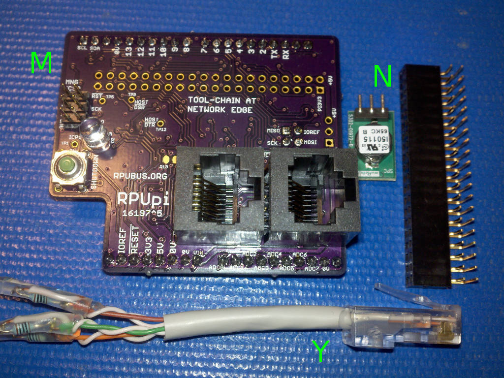
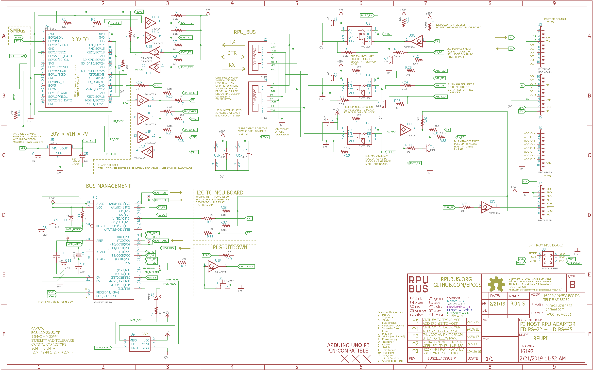

# Hardware

## Overview

This board connects a Pi Zero to a multi-drop RS-422 bus and a [RPUno] board.

[RPUno]: https://github.com/epccs/RPUno

## Inputs/Outputs/Functions

```
        Pi Zero power is from a 5V SMPS regulator powered by the Vin pin
        Pi Zero UART connects to RS-422 pairs (e.g. Pi Tx to RPU_BUS Rx)
        RS-422 pairs daisy-chain to other RPUadpt boards
        RPUno UART connects to RS-422 pairs (e.g. 328p Rx to RPU_BUS Rx)
        An out of band management pair is also available
        SPI is available between Pi Zero and local RPUno
```

## Uses

```
        Use solar power (e.g. 20W PV needed) from a [RPUno] to run a Pi Zero
        Pi with Linux, ssh, Python, and AVR toolchain is a compelling platform.
        Allows (locally compiled) updates without exposing serial ports to a network.
```

## Notice

```
        If the SBC bootloads its local [RPUno] it must not turn off VIN power after the reset.
```


# Table Of Contents

1. [Status](#status)
2. [Design](#design)
3. [Bill of Materials](#bill-of-materials)
4. [How To Use](#how-to-use)


# Status


```
        ^2  Done: Design, Layout, BOM,
            WIP: Review*,
            Todo:  Order Boards, Assembly, Testing, Evaluation.
            *during review the Design may change without changing the revision.
            Run I2C form MCU board to bus manager with 3V3 pull-up (not to Pi).
            Add Option to use I2C1 with a ATmega328pb (note the Pi will pull these lines down when power is off).
            Add pull up to the Pi Tx line.
            Add 10k on SCK and MOSI so the 74LVC07 can't damage the MCU board's SPI pins.
            Have PI3V3 power the 74LVC07, ouputs hi-z (IOFF) when power is off.
            Move Pi back .2"
            Add 74LVC07 buffer to Pi seril interface so it will hi-z (IOFF) nRTS and PI_TX when PI3V3 is off.
            populate with 12MHz crystal to use 250kbit rate on DTR pair.

        ^1  Done: Design, Layout, BOM, Review*, Order Boards, Assembly, Testing,
            WIP: Evaluation.
            location: 2017-2-6 Test Bench, used as an RPUadpt with an RPUno^4.
            location: 2017-4-11 Scrap (in que).
```

Debugging and fixing problems i.e. [Schooling](./Schooling/)

Setup and methods used for [Evaluation](./Evaluation/)


# Design

The board is 0.063 thick, FR4, two layer, 1 oz copper with ENIG (gold) finish.





## Electrical Parameters (Typical)

```
        VIN pin needs 7V to 30V (RPUno has 12.8V) at up to 4W for SMPS regulator to power a Pi Zero
        5V pin needs 150mA (RPUno has 1+ Amp) to power RPU_BUS
```

## Mounting

```
        Shield or Mezzanine
```

## Electrical Schematic



## Testing

Check correct assembly and function with [Testing](./Testing/)


# Bill of Materials

Import the [BOM](./Design/16197,BOM.csv) into LibreOffice Calc (or Excel) with semicolon separated values, or use a text editor.


# How To Use

## Pi Zero Setup 

The Pi Zero is a Single Board Computer (SBC) running [Linux]. I use it as a host machine since it has enough memory and processing power for the AVR toolchain as well as self-hosted compiling and other applications and services. My use is kind of like a small headless SCADA system controller for the RPUno boards I daisy-chained with CAT5. It is not an IoT setup since the control system is self-contained, and I still don't see a compelling reason to send data about my garden to the Nebula or is relative Nimbus.

[Linux]: ./Testing/linux.md

The BCM2835 Broadcom chip used in the Raspberry Pi Zero is a Cortex-A7 (aka ARM11) running at 1 GHz it is well supported by many Linux distributions, with [Raspbian] being the main distribution that the Raspberry Pi Foundation points to. 

[Raspbian]: https://www.raspbian.org/

__WARNING: The shield will be damaged if removed from a powered RPUno board. Before separating a shield from the RPUno it is very important to check that all power sources are disconnected.__

## Serial

The Pi serial port (RX is BCM 15 and TX is BCM 14) connects to transceivers that drive differential pairs and then crossover to go to the shield's header for Tx and Rx (e.g. Pi BCM Rx goes to Tx pin on the shield for MCU's UART). This allows the Pi Zero to talk to the MCU's UART with serial as is expected. But the serial is also copyed on the differential pairs, and can be daisy-chained with CAT5 to other nodes using an RPUadpt shield. 


The Pi's handshake lines nCTS and nRTS lines are on BCM 16 and 17 when the ALT3 option is active. BCM 17 is on the original 26 pin Pi connector, but BCM 16 is on the new 40 pin connector. I use this [rpirtscts] program as a command-line utility for enabling hardware flow control on the Pi Zero serial port. 

[rpirtscts]: https://github.com/epccs/RPUpi/tree/master/RPiRtsCts

The Pi Zero serial lines (Rx, Tx, nRTS, and nCTS) are interfaced through a 74LVC07A buffer which is powered from the Pi's 3V3 power. When the Pi Zero is powered off the IOFF feature of the buffer will turn off (or hi-z) it's open collector output which will allow a pull-up to set the proper value on nRTS and the Tx line from the host. This allows the RPU_BUS to be used when the Pi Zero is powered off (or not plugged in).

The Pi can run avrdude which allows programming AVR's serial bootloaders. 

## Management

The shield has a bus manager, though its firmware is in development. It has access to enable/disable each transceiver's receiver and/or driver. This means that each (or all) node(s) can be isolated from the serial bus (both host and/or MCU), the implications are significant. The original intent was to allow boot loading with a point to point full duplex mode (e.g. optiboot/xboot and avrdude need this). The goal is to allow boot loading a new executable binary image even if the bare metal application is severely goofed up (similar to an Arduino Uno). 

## Transceiver (RS-485)

The transceivers have a built-in fail-safe bias, which is a little complicated to explain, but it makes an undriven bus (e.g. the failed condition) a defined true or high state. That is if I turn off all the transceiver's driving the bus (only one should do that), it is guaranteed to be in a defined state (e.g. the true state). I have setup the transceivers to turn off the driver while the UART output is a true (e.g. its default value). That further means the driver will automatically drive the bus only when data is sent (e.g. drives when a zero or false bit is transmitted), so nothing needs to be done in software to turn off the bus (except to not talk, which can be a challenge). The bus manager can be used (I2C) to enable/disable the transceiver's receiver and/or driver (requires your firmware on the bus manager to do so, this is only hardware).

## SPI

The Pi Zero SPI lines (MOSI, SCK, MISO) are interfaced through a 74LVC07A buffer which is powered from the Pi's 3V3 power. When the Pi Zero is powered off the IOFF feature of the buffer will turn off (or hi-z) it's open collector output which will allow a pull-up (IOREF from the MCU board) to set the value on SCK and the MOSI line from the host. 

Known issues: RPUno maps its SPI lines to the plugable connectors for digital control (e.g. the K3 board needs the lines). I am not yet sure the best way to offer this.

## I2C

The Pi I2C port is not connected to the onboard bus manager. The Pi has 1.8k pull-ups to 3.3V, and when the shield powers down VIN it will pull down the I2C lines as the Pi can no longer sustain its 3.3V supply. 

A future update may include an ATmega328pb that has an extra I2C interface that could be used as an independent channel between the Pi Zero and the manager without locking up the MCU to the manager when the Pi Zero is powered down. 

## SD

Card [corruption] seems to happen when the SD card is doing wear leveling operations at the time power is removed. It may be possible with this setup to push the shutdown button and have that run a script that before halting tells the node to wait for a while and then make sure the current draw from the battery is stabilized before turning off VIN or disconnecting the battery. The idea is that wear leveling will draw current somewhat randomly until all the page updates are done. The BCM2835 will be halted, and looping (it is checking one of the I2C pins) and using a steady current draw. So when the current draw is stable the wear leveling should be done and safe to disconnect power.

[corruption]: http://hackaday.com/2016/08/03/single-board-revolution-preventing-flash-memory-corruption/

## Agile

I'm not an Agile developer but someone once tried (and failed) to encapsulate some good ideas. When developing software or hardware (the RPUpi for example) the only thing that seems to get results is to first make something, anything really, and then start fixing the broken stuff. Add new stuff to push it in the desired direction (that is not evolution BTW, but it is also not intelligent design, it is something in between). Keep iterating by fixing, and adding (and sometimes change direction when needed). It will never be truly finished, but at some point, things start to click and reveal if it is useful or useless. To speed up this process with software development the hardware needs to be easy to remotely program, and I guess I like how an AVR with a serial bootloader does this trick. It allows full hardware control by uploading an executable binary image compiled from C (or C++ if you can deal with heap and stack usage better than I). Allowing a peasant, like myself, direct access to the machine registers is normally a bad idea, but that is what maximizes options. Understand that hardware of this nature has no safety guards, again the uploaded machine code has full register level access, the training wheels are off.


## Security

A Yun [worm].

[worm]: http://hackaday.com/2016/11/11/arduworm-a-malware-for-your-arduino-yun/

One lesson I see is to not expose the raw serial hardware on a network. Although I try to keep track of the serial line length and ignore bytes when a line is too long in my examples, I bet there are areas that leak. I use C and avoid the malloc functions so the stack memory alone is used (not heap memory). Arduino compiles with C++ which mixes heap and stack memory usage in complicated ways I don't understand (and have had problems with). On the Pi C++ is fine since Linux can manage the heap fairly well, but bare metal does nothing for heap memory management it just makes a fragmented mess.  Anyway I tend to use Python on the Pi, so my C++ is never going to imporve.

