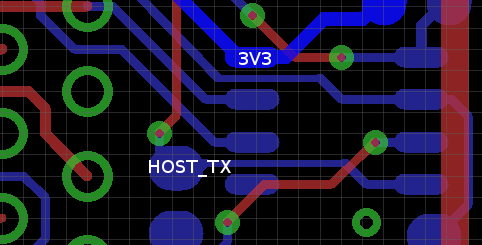

# Description

Some lessons I learned doing RPUpi.

# Table Of Contents:

2. [ ^1 Pi Tx Pull-Up](#1-pi-tx-pull-up)
2. [ ^1 I2C](#1-i2c)
1. [ ^0 U3 Placed Backward](#0-u3-placed-backward)

## ^1 Pi Tx Pull-Up

Add a 10k pull up to the Pi Zero Tx line. This will automatically disable the transceiver driver when the Pi is not powered or is absent.

## ^1 I2C

Cut I2C from Pi Zero and use a 1.8k pull-up to the bus manager 3V3. I am using I2C between the RPUno and bus manager to pass the rpu_bus address, I would prefer the RPUno programs work with an RPUpi shield without change. So the I2C from Pi to bus manager needs removed. Also when the RPUno kills power to the Pi that will pull down the I2C lines and block the bus manager from I2C communication with the RPUno.

## ^0 U3 Placed Backward

I though the via was my mark for pin one, need to fix the packages so this does not happen again.

