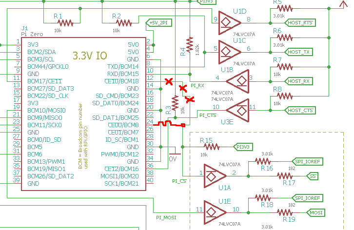
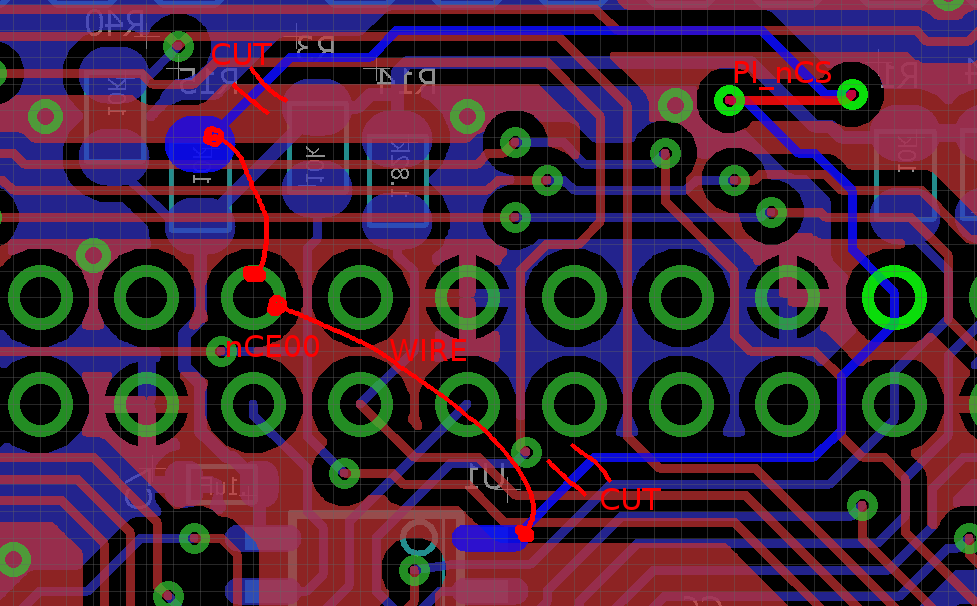
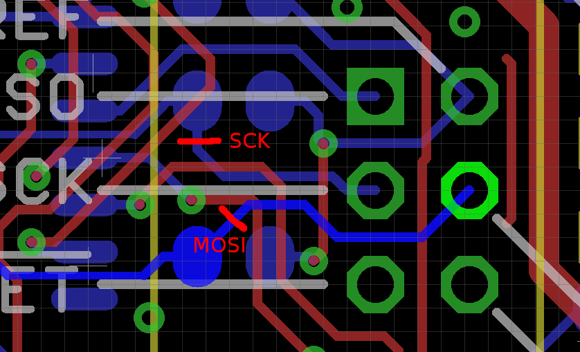

# Description

Some lessons I learned doing RPUpi.

# Table Of Contents:

1. ^4 nSS to CE10 WTF
1. ^3 Connect nSS to SBC CE10
1. ^2 Protect I2C With 182 Ohm 
1. ^2 RS-422 Buffer needs Power
1. ^1 Serial When Powered Down
1. ^1 Pi Zero Placement
1. ^1 Open SCK and MOSI
1. ^1 Pi Tx Pull-Up
1. ^1 I2C
1. ^0 U3 Placed Backward

## ^4 nSS to CE10 WTF

No no no... that is not what was tested, it was tested with nCE00 the RPUadpt test setup photo clearly shows it was nCE00. So I assembled one ^4 board and will rework it then finish testing.

## ^3 Connect nSS to SBC CE10

When SPI uses chip enable it tells the slave to start a transaction, and the slave can align the data to the start.

This was tested with RPUadpt^6, and needs added to the next revision.

## ^2 Protect I2C With 182 Ohm

Add 182 Ohm in-line between shield pins and bus manager.

## ^2 RS-422 Buffer needs Power

When U3 (74LVC07) does not have power the serial RX and TX from shield can not reach RS-422 transceivers. 

For testing, I need to cut U3 power from the PI3V3 node and bridge it to +3V3 node.

If U3E and U3F can be flipped with U1E and U1F that would also be helpful, U3B is fine as is.

## ^1 Serial When Powered Down

When the Pi is powered down the nRTS line, which is active low seems to become active. Also, HOST_TX pulls down and causes a bus lock-up. Finally nCTS, HOST_RX sinks too much current from the transceivers without some sort of protection when Pi is powered down.

 Another 74LVC07 with Pi as target is needed to fix all this.

## ^1 Pi Zero Placement

The Pi Zero fits but if it can be moved in that would be helpful. I think the SMPS can rotate and I can ditch the SWD port.

## ^1 Target Should Power 74LVC07 

In this case the Pi is the target, and it should power the 74LVC07 buffer I used for level shifting. If the target is off it disables the IC (and the open drain is hi-z). If the target has 3.3V the IC is on and tolerant of 5V on its inputs. The outputs can be pulled up to 5V or 3.3V as needed. Also the inputs are tolerant of 5V when power is off.

Note: I am using the term target sort of like how I view ICSP, which is to say the thing that will get powered off. In this case oddly enough the bare metal  board (RPUno) will not power off, and is therefor not what I'm calling the target (I need to find a better way to say this...).

## ^1 Open SCK and MOSI

The 74LVC07 can damage the AVR by sinking current, therefore I need to open these traces and place a 10k Ohm resistor. This will allow the AVR to drive without causing damage when the 74LVC07's open drain output is sinking.

Some nasty rework to add the 10k for more evaluation.

## ^1 Pi Tx Pull-Up

Add a 10k pull up to the Pi Zero Tx line. This will automatically disable the transceiver driver when the Pi is not powered or is absent.

## ^1 I2C

Cut I2C from Pi Zero and use a 1.8k pull-up to the bus manager 3V3. I am using I2C between the RPUno and bus manager to pass the rpu_bus address, I would prefer the RPUno programs work with an RPUpi shield without change. So the I2C from Pi to bus manager needs removed. Also when the RPUno kills power to the Pi that will pull down the I2C lines and block the bus manager from I2C communication with the RPUno.

## ^0 U3 Placed Backward

I though the via was my mark for pin one, need to fix the packages so this does not happen again.

