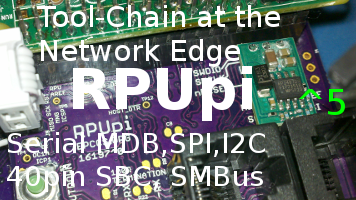

# RPUpi

From <https://github.com/epccs/RPUpi>

## Overview

Shield used to connect a Pi Zero host to [RPUno], and a multidrop RS-422 (RPU_BUS) that can connect additional RPUno with [RPUadpt] shields.

[HackADay](https://hackaday.io/project/16424-rpupi)

[Forum](http://rpubus.org/bb/viewforum.php?f=8)

[OSHpark](https://oshpark.com/shared_projects/KWIJgjF8)

[RPUno]: https://github.com/epccs/RPUno
[RPUadpt]: https://github.com/epccs/RPUadpt
[RPUftdi]: https://github.com/epccs/RPUftdi

## Status

## [Hardware](./Hardware)

Hardware files are in Eagle, there is also some testing, evaluation, and schooling notes for referance.

## Example

A Pi Zero Host computer issues commands to the RPU_BUS microcontrollers over a serial (UART) interface. The microcontrollers run a command processor that accepts interactive textual commands that operate the microcontroller peripherals as a bare metal system. This means the microcontroller can perform event capture task for a flow meter or control an array of half-bridge power outputs to run a BLDC water pump. 

## AVR toolchain

The core files for this board are in the /lib folder. Each example has its files and a Makefile in its own folder. The toolchain packages that I use are available on Ubuntu and Raspbian. 

* sudo apt-get install [gcc-avr]
* sudo apt-get install [binutils-avr]
* sudo apt-get install [gdb-avr]
* sudo apt-get install [avr-libc]
* sudo apt-get install [avrdude]
    
[gcc-avr]: http://packages.ubuntu.com/search?keywords=gcc-avr
[binutils-avr]: http://packages.ubuntu.com/search?keywords=binutils-avr
[gdb-avr]: http://packages.ubuntu.com/search?keywords=gdb-avr
[avr-libc]: http://packages.ubuntu.com/search?keywords=avr-libc
[avrdude]: http://packages.ubuntu.com/search?keywords=avrdude[avrdude](http://packages.ubuntu.com/search?keywords=avrdude)