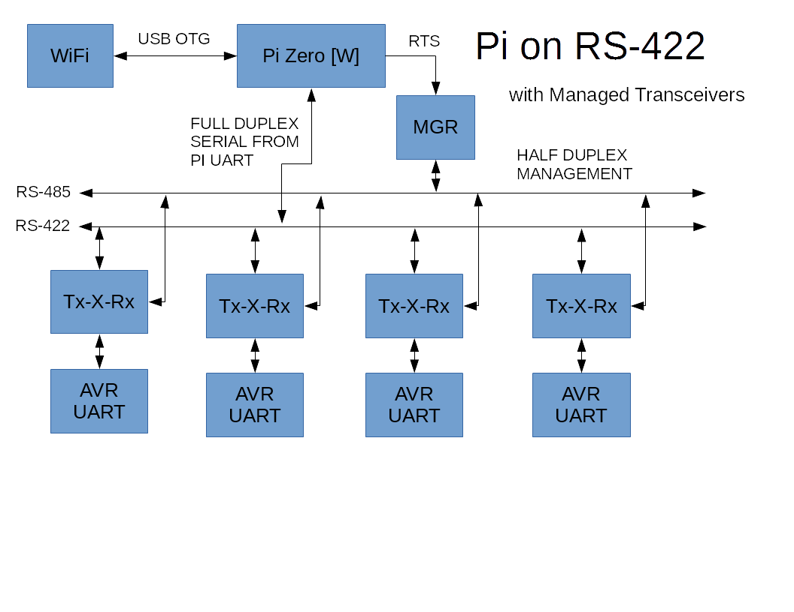
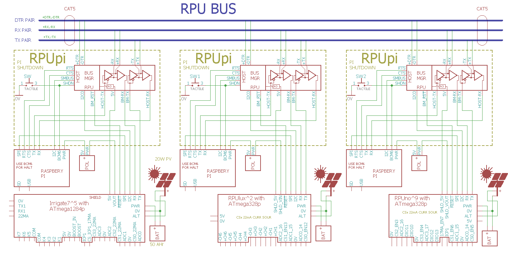

# RPUpi

From <https://github.com/epccs/RPUpi>

## Overview

Shield used to connect a Pi Zero (or W) host to a multidrop RS-422 (RPU_BUS) and an [RPUno] or [Irrigate7]. The multidrop bus can connect additional [RPUno] or [Irrigate7] with [RPUadpt] shields.

[HackADay](https://hackaday.io/project/16424-rpupi)

[Forum](http://rpubus.org/bb/viewforum.php?f=8)

[OSHpark](https://oshpark.com/shared_projects/KWIJgjF8)

[RPUno]: https://github.com/epccs/RPUno
[Irrigate7]: https://github.com/epccs/Irrigate7
[RPUadpt]: https://github.com/epccs/RPUadpt
[RPUftdi]: https://github.com/epccs/RPUftdi

## Status


## [Hardware](./Hardware)

Hardware files are in Eagle, there is also some testing, evaluation, and schooling notes for referance.

## Example

A Pi Zero host computer interfaces with several microcontrollers through its serial (UART) interface in this simplified diagram. 



The microcontrollers and Pi can run common serial communication software. I prefer textual commands, so my examples generally use a textual command processor which echo back the command like an interactive terminal, the commands operate firmware routines on the bare metal microcontrollers. The firmware is compiled from source that is version managed on GitHub, it is then uploaded to the targets with a serial bootloader and open source tools on Raspbian that are part of the AVR toolchain. AVR microcontrollers have a no fuss toolchain for them is on Debian (which is where Pi's Raspbian is from). The Pi does not need to be on a network but I generally setup SSH on it so I have a way to do remote access. 



To bootload the AVR from the Pi's serial port, first it needs to be disabled as a [debug port] and then enabled for [serial] use, also the [RTS and CTS] pin functions should be enabled (since nRTS is used to start the bootloader). 

[debug port]: ./Hardware/Testing/linux.md#serial
[serial]: ./Hardware/Testing/linux.md#serial
[RTS and CTS]: ./RPiRtsCts

The Pi Zero also needs a way to initiate a [halt] from a push button. When the RPUpi shield is mounted on an [RPUno] the VIN pin can be powered off with a somewhat involved [power management] firmware technique.  This allows a manual shutdown, or the RPUno can request a halt with an I2C command,  or the Pi can request the RPUno to request a halt over its serial interface (or perhaps a heartbeat to keep it active). 

[halt]: ./Shutdown
[power management]: https://github.com/epccs/RPUno/tree/master/PwrMgt

## AVR toolchain

The core files for this board are in the /lib folder. Each example has its files and a Makefile in its own folder. The toolchain packages that I use are available on Ubuntu and Raspbian. 

```
sudo apt-get install git gcc-avr binutils-avr gdb-avr avr-libc avrdude
git clone https://github.com/epccs/RPUpi
```

* [gcc-avr](http://packages.ubuntu.com/search?keywords=gcc-avr)
* [binutils-avr](http://packages.ubuntu.com/search?keywords=binutils-avr)
* [gdb-avr](http://packages.ubuntu.com/search?keywords=gdb-avr)
* [avr-libc](http://packages.ubuntu.com/search?keywords=avr-libc)
* [avrdude](http://packages.ubuntu.com/search?keywords=avrdude)